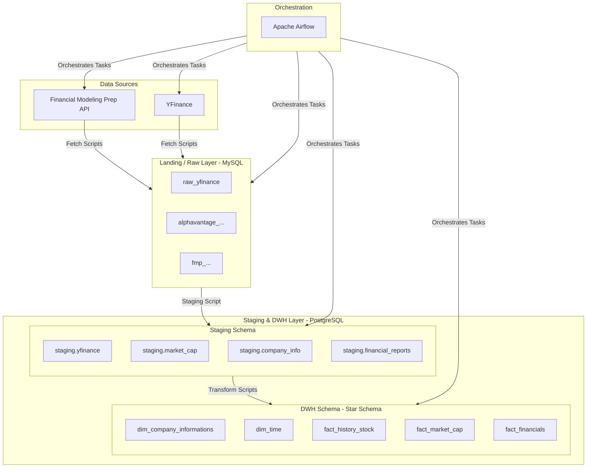

# 🏗️ Building a Stock Data Warehouse with Airflow & Docker


This project implements a complete **data engineering pipeline** that fetches, stages, and transforms historical and daily stock data into a centralized **Data Warehouse**. The entire system is orchestrated by **Apache Airflow** and containerized using **Docker**.

---

## 🧩 System Architecture

The system is designed with a multi-layer architecture to ensure modularity, scalability, and ease of maintenance.




| Layer | Description | Technology | Database |
| :--- | :--- | :--- | :--- |
| **Landing (Raw)** | Stores raw, unprocessed data fetched directly from APIs. | MySQL 8.0 | `extract_db` |
| **Staging** | Data is cleaned, standardized, and loaded incrementally. | PostgreSQL 14 | `de_psql` |
| **Data Warehouse**| Data is transformed into a Star Schema model for analytical purposes. | PostgreSQL 14 | `de_psql` |
| **Orchestration** | Schedules and orchestrates the entire daily ETL pipeline. | Apache Airflow | - |

---

## ⚙️ Tech Stack

| Component | Technology |
| :--- | :--- |
| **Orchestration** | Apache Airflow 2.9.2 |
| **Containerization** | Docker & Docker Compose |
| **Database** | MySQL 8.0 (Landing), PostgreSQL 14 (Staging & DWH) |
| **Language** | Python 3.10+ |
| **APIs** | Financial Modeling Prep, YFinance |
| **Data Libraries** | Pandas, SQLAlchemy |

---

## 📁 Project Structure

```
.
├── airflow/
│   ├── dags/
│   │   └── stock_dw_dag.py         # Main DAG that orchestrates the entire pipeline
│   ├── logs/                       # Airflow logs
│   └── plugins/                    # Contains custom operators, hooks (if any)
├── script/
│   ├── extract/                    # Scripts to fetch data from APIs to the Landing layer (MySQL)
│   │   ├── fetch_balance_sheet.py
│   │   ├── fetch_cashflow.py
│   │   ├── ...
│   │   └── fetch_yfinance.py
│   ├── staging/
│   │   └── mysql_to_postgres_staging.py # Script to move data from Landing to Staging
│   └── transform/                  # Scripts to transform data from Staging to DWH
│       ├── transform_dim_company_information.py
│       ├── transform_fact_balance_sheet.py
│       └── ...
├── sql/
│   ├── extract_db.sql              # DDL for the Landing layer (MySQL)
│   └── init.sql                    # DDL for the Staging and DWH layers (PostgreSQL)
├── .env.example                    # Example environment file
├── docker-compose.yaml             # Defines all services (Airflow, MySQL, Postgres)
├── Dockerfile                      # Builds a custom image for Airflow
└── README.md
```

---

## 🧠 Pipeline Logic (`finance_etl_master_pipeline`)

The entire pipeline is defined in a single DAG, `finance_etl_master_pipeline`, which runs automatically every day (`@daily`).

The pipeline is divided into 4 Task Groups:

1.  **`group_fetch_daily` (Daily Data Fetch):**
    *   Fetches historical stock prices from `yfinance`.
    *   Fetches market capitalization from FMP.
    *   Fetches detailed company information from FMP.

2.  **`group_fetch_limited` (Rotational Data Fetch):**
    *   To avoid API rate limits, this group runs only **one** of four financial report tasks each day on a rotational basis (determined by the day of the year).
    *   `fetch_earnings`
    *   `fetch_income_statement`
    *   `fetch_balance_sheet`
    *   `fetch_cashflow`

3.  **`group_staging` (Load to Staging):**
    *   After the fetch tasks succeed, data is moved from the Landing layer (MySQL) to the Staging layer (PostgreSQL) using an incremental method (only new data is loaded).

4.  **`group_transform` (Transform to Data Warehouse):**
    *   Transforms data from Staging into the Star Schema model within the `dwh` schema.
    *   `transform_dim_company`: Creates or updates the company dimension table (applying SCD Type 2).
    *   `transform_fact_*`: Creates the corresponding fact tables (price history, market cap, financial reports, etc.).

**Data Flow:** `(group_fetch_daily, group_fetch_limited)` -> `group_staging` -> `group_transform`.

---

## 📊 Data Model

### Landing Layer (MySQL - `extract_db`)
Stores raw data from various sources.
- `raw_yfinance`: Stock price data.
- `alphavantage_cash_flow`: Cash flow data.
- `alphavantage_balance_sheet`: Balance sheet data.
- `alphavantage_income_statement`: Income statement data.
- `alphavantage_earnings`: Earnings data.
- `fmp_company_information`: Company profile information.
- `fmp_company_market_cap`: Market capitalization data.

### Data Warehouse Layer (PostgreSQL - `dwh`)
A Star Schema model for analytics.

**Dimension Tables:**
-   **`dim_time`**: Contains detailed time-related attributes (day, month, quarter, year, day of a week, etc.).
-   **`dim_company_informations`**: Contains company profile information. This table implements **Slowly Changing Dimension (SCD) Type 2** to track historical changes (e.g., CEO, address).

**Fact Tables:**
-   **`fact_history_stock`**: Daily stock price and volume history.
-   **`fact_market_cap`**: Daily market capitalization.
-   **`fact_cash_flow`**: Data from cash flow statements (quarterly/annually).
-   **`fact_balance_sheet`**: Data from balance sheets.
-   **`fact_income_statement`**: Data from income statements.
-   **`fact_earnings`**: Earnings Per Share (EPS) data.

---

## 🔧 Setup and Usage Guide

### 1. Clone the Project
```bash
git clone <your-repository-url>
cd <repository-folder>
```

### 2. Configure Environment
Create a `.env` file from the example and fill in your API key.
```bash
cp .env.example .env
```
Then, open the `.env` file and add your `FMP_API_KEY`:
```env
# .env
# ... (other environment variables are already set)

# API Keys
FMP_API_KEY=your_fmp_api_key_here
```

### 3. Launch the System
Use Docker Compose to build and launch all services (Airflow, MySQL, PostgreSQL). The `-d` flag runs the containers in detached mode.
```bash
docker-compose up --build -d
```
The system may take a few minutes to initialize on the first run.

### 4. Access Airflow UI
-   Navigate to `http://localhost:8080` in your web browser.
-   **Login:** `airflow` / `airflow`

### 5. Activate the DAG
-   On the Airflow UI homepage, find the DAG named `finance_etl_master_pipeline`.
-   Toggle the "paused" button to "active" to enable the schedule.
-   You can also trigger a manual run by clicking the "Play" button (Trigger DAG).

---

## 💡 Future Improvements
-   Integrate **dbt** for more robust and maintainable transformations.
-   Use **Great Expectations** for data quality testing and validation.
-   Deploy the system to a cloud provider (AWS, GCP) using Terraform.
-   Build an analytical dashboard using Metabase or Power BI.