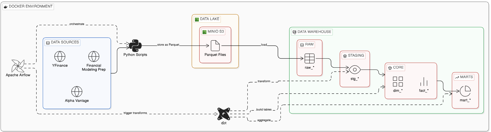
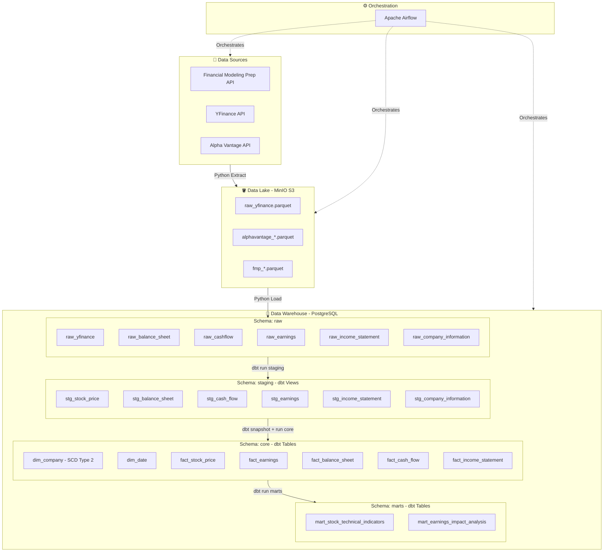

# 🏗️ Building Stock Analytics Pipeline


A production-grade **ELT data pipeline** that fetches stock market data from multiple APIs, stores raw files in a **Data Lake (MinIO/Parquet)**, loads into **PostgreSQL**, and transforms into a **Star Schema Data Warehouse** using **dbt**. Orchestrated end-to-end by **Apache Airflow** and fully containerized with **Docker**.

---

## 🧩 System Architecture (Medallion Architecture)



```mermaid
graph TD;
    subgraph Sources["📡 Data Sources"]
        direction LR
        API_FMP[Financial Modeling Prep API]
        API_YF[YFinance API]
        API_AV[Alpha Vantage API]
    end

    subgraph Lake["🪣 Data Lake - MinIO S3"]
        direction LR
        PQ1[raw_yfinance.parquet]
        PQ2[alphavantage_*.parquet]
        PQ3[fmp_*.parquet]
    end

    subgraph DW["🐘 Data Warehouse - PostgreSQL"]
        subgraph Raw["Schema: raw"]
            direction TB
            R1[raw_yfinance]
            R2[raw_balance_sheet]
            R3[raw_cashflow]
            R4[raw_earnings]
            R5[raw_income_statement]
            R6[raw_company_information]
        end
        subgraph Staging["Schema: staging - dbt Views"]
            direction TB
            S1[stg_stock_price]
            S2[stg_balance_sheet]
            S3[stg_cash_flow]
            S4[stg_earnings]
            S5[stg_income_statement]
            S6[stg_company_information]
        end
        subgraph Core["Schema: core - dbt Tables"]
            direction TB
            D1[dim_company - SCD Type 2]
            D2[dim_date]
            F1[fact_stock_price]
            F2[fact_earnings]
            F3[fact_balance_sheet]
            F4[fact_cash_flow]
            F5[fact_income_statement]
        end
        subgraph Marts["Schema: marts - dbt Tables"]
            direction TB
            M1[mart_stock_technical_indicators]
            M2[mart_earnings_impact_analysis]
        end
    end

    subgraph Orch["⚙️ Orchestration"]
        Airflow[Apache Airflow]
    end

    Sources -- "Python Extract" --> Lake
    Lake -- "Python Load" --> Raw
    Raw -- "dbt run staging" --> Staging
    Staging -- "dbt snapshot + run core" --> Core
    Core -- "dbt run marts" --> Marts
    Airflow -. "Orchestrates" .-> Sources
    Airflow -. "Orchestrates" .-> Lake
    Airflow -. "Orchestrates" .-> DW
```

| Layer | Schema | Description | Materialization |
| :--- | :--- | :--- | :--- |
| **Data Lake** | MinIO S3 | Raw Parquet files fetched from APIs | Parquet files |
| **Raw** | `raw` | Verbatim data loaded from Parquet into Postgres | Tables (Python) |
| **Staging** | `staging` | Cleaned, typed, trimmed data with surrogate keys | Views (dbt) |
| **Core** | `core` | Dimensional model: Fact & Dim tables, SCD Type 2 snapshots | Tables (dbt) |
| **Marts** | `marts` | Aggregated, business-ready analytical tables | Tables (dbt) |

---

## ⚙️ Tech Stack

| Component | Technology |
| :--- | :--- |
| **Orchestration** | Apache Airflow 2.9.2 |
| **Data Transformation** | dbt-core 1.7 (dbt-postgres) |
| **Data Lake** | MinIO (S3-compatible Object Storage) |
| **Data Warehouse** | PostgreSQL 14 |
| **Containerization** | Docker & Docker Compose |
| **Language** | Python 3.10+, SQL (Jinja) |
| **APIs** | Financial Modeling Prep, YFinance, Alpha Vantage |
| **Libraries** | Pandas, SQLAlchemy, s3fs, boto3 |

---

## 📁 Project Structure

```
.
├── airflow/
│   ├── dags/
│   │   └── stock_dw_dag.py            # Master DAG orchestrating the ELT pipeline
│   ├── logs/
│   └── plugins/
├── dbt/
│   ├── models/
│   │   ├── staging/                    # Staging layer: data cleaning & type casting
│   │   │   ├── sources.yml            # Source definitions (raw schema)
│   │   │   ├── stg_stock_price.sql
│   │   │   ├── stg_company_information.sql
│   │   │   ├── stg_balance_sheet.sql
│   │   │   ├── stg_cash_flow.sql
│   │   │   ├── stg_income_statement.sql
│   │   │   └── stg_earnings.sql
│   │   ├── core/                       # Core layer: Star Schema (Dim/Fact)
│   │   │   ├── schema.yml             # dbt tests (unique, not_null, relationships)
│   │   │   ├── dim_company.sql        # SCD Type 2 company dimension
│   │   │   ├── dim_date.sql           # Auto-generated 30-year date dimension
│   │   │   ├── fact_stock_price.sql
│   │   │   ├── fact_earnings.sql
│   │   │   ├── fact_balance_sheet.sql
│   │   │   ├── fact_cash_flow.sql
│   │   │   └── fact_income_statement.sql
│   │   └── marts/                      # Marts layer: business-ready analytics
│   │       ├── mart_stock_technical_indicators.sql
│   │       └── mart_earnings_impact_analysis.sql
│   ├── snapshots/
│   │   └── snp_company.sql            # SCD Type 2 snapshot for company changes
│   ├── macros/
│   │   └── generate_schema_name.sql   # Custom schema routing macro
│   ├── dbt_project.yml
│   ├── profiles.yml
│   └── packages.yml                   # dbt_utils package
├── script/
│   ├── extract/                        # Python scripts: API → Data Lake (MinIO)
│   │   ├── fetch_yfinance.py
│   │   ├── fetch_company_information.py
│   │   ├── fetch_earnings.py
│   │   ├── fetch_balance_sheet.py
│   │   ├── fetch_cashflow.py
│   │   └── fetch_income_statement.py
│   ├── load/                           # Python scripts: Data Lake → Raw Schema
│   │   └── load_to_staging.py
│   └── stock_list.csv
├── sql/
│   └── init.sql
├── docker-compose.yaml
├── Dockerfile
├── .env
└── README.md
```

---

## 🧠 Pipeline Logic (`finance_etl_master_pipeline`)

The DAG runs daily (`@daily`) and is divided into 4 Task Groups:

### 1. `group_fetch_daily` — Daily Data Fetch
- **fetch_yfinance**: Stock prices (OHLCV) → MinIO Parquet
- **fetch_marketcap**: Market capitalization → MinIO Parquet
- **fetch_company_information**: Company profiles → MinIO Parquet

### 2. `group_fetch_limited` — Rotational Fetch (1 per day)
Rotates daily to respect API rate limits:
- `fetch_earnings` / `fetch_income_statement` / `fetch_balance_sheet` / `fetch_cashflow`

### 3. `group_load_raw` — Load to Raw Schema
- Reads Parquet files from MinIO and loads into PostgreSQL `raw` schema (CDC incremental).

### 4. `group_dbt_transform` — Transform with dbt
Sequential dbt execution:
```
dbt run staging → dbt snapshot → dbt run core → dbt run marts → dbt test
```

**Data Flow:**
```
[group_fetch_daily, group_fetch_limited] → group_load_raw → group_dbt_transform
```

---

## 📊 Data Model

### Staging Layer (`staging` schema — dbt Views)
Cleans raw data: `TRIM`, `CAST`, `COALESCE`, generates surrogate keys via `dbt_utils.generate_surrogate_key`.

### Core Layer (`core` schema — dbt Tables)

**Dimension Tables:**
- **`dim_company`**: Company profiles with **SCD Type 2** tracking (CEO, industry, sector changes). Columns: `company_key`, `company_id`, `symbol`, `valid_from`, `valid_to`, `is_current`.
- **`dim_date`**: Auto-generated calendar (2000–2030) with `date_key` (INT YYYYMMDD), `day_name`, `month_name`, `is_weekend`, `is_month_end`.

**Fact Tables:**
- **`fact_stock_price`**: Daily OHLCV data joined to `dim_company` (SCD-aware) and `dim_date`.
- **`fact_earnings`**: EPS data with Role-Playing Dimensions (`reported_date_key`, `fiscal_date_ending_key`).
- **`fact_balance_sheet`**: Balance sheet financials.
- **`fact_cash_flow`**: Cash flow statement data.
- **`fact_income_statement`**: Income statement data.

### Marts Layer (`marts` schema — dbt Tables)

- **`mart_stock_technical_indicators`**: Pre-computed MA7, MA30, Daily Return %, Spread %, Volatility, 20-Day High/Low using SQL Window Functions. *Serves: Investment Analysis team.*
- **`mart_earnings_impact_analysis`**: Measures stock price impact (%) within 3 days after earnings announcements. *Serves: Strategy/News team.*

---

## 🔧 Setup and Usage

### 1. Clone & Configure
```bash
git clone <your-repository-url>
cd <repository-folder>
cp .env.example .env
# Edit .env with your API keys (FMP_API_KEY, ALPHA_VANTAGE_API_KEY)
```

### 2. Launch
```bash
docker-compose up --build -d
```

### 3. Access Services
| Service | URL | Credentials |
| :--- | :--- | :--- |
| **Airflow UI** | http://localhost:8080 | `airflow` / `airflow` |
| **MinIO Console** | http://localhost:9001 | `minioadmin` / `minioadmin` |
| **PostgreSQL DWH** | `localhost:5433` | `admin` / `admin` (db: `de_psql`) |

### 4. Run dbt Manually
```bash
docker-compose run --rm dbt run        # Run all models
docker-compose run --rm dbt test       # Run data quality tests
docker-compose run --rm dbt snapshot   # Run SCD Type 2 snapshots
```

---

## ✅ Data Quality (dbt Tests)

Automated tests defined in `schema.yml`:
- **`unique`**: No duplicate primary keys in Dim/Fact tables.
- **`not_null`**: Critical columns (keys, prices) must not be NULL.
- **`relationships`**: Foreign keys in Facts must reference valid Dimension records.

---

## 💡 Future Improvements
- Add **dbt_expectations** for advanced data quality checks (e.g., price >= 0).
- Build analytical dashboards using **Power BI** or **Metabase**.
- Deploy to cloud (AWS/GCP) using Terraform.
- Implement **Great Expectations** for end-to-end data validation.
- Add **dbt docs generate** for auto-generated data documentation.